# Hi, I'm Tam

Developer in Ho Chi Minh City. I take messy public data and turn it into something you can hold in one hand: a single Go binary, a browsable index, a clean line of JSON. I write the notes down as I go, and I translate the books and docs I learned from into Vietnamese so they reach more people.

## What I build

### Site CLIs

One small Go binary per website. Point it at public data, get back structured JSON or JSONL, no API key required. They all sit on a shared framework so each repo only carries its own data domain.

- [ytb-cli](https://github.com/tamnd/ytb-cli) reads YouTube: videos, channels, search, comments, transcripts
- [x-cli](https://github.com/tamnd/x-cli) reads X over the free public surface
- [amz-cli](https://github.com/tamnd/amz-cli), [archive-cli](https://github.com/tamnd/archive-cli), and roughly 240 more in the same family
- [any-cli](https://github.com/tamnd/any-cli) scaffolds a new one, fully wired, in a few seconds
- [ant](https://github.com/tamnd/ant) is the front door: every public record is a URI, and ant dereferences it
- [kumo](https://github.com/tamnd/kumo) crawls a whole host into structured files

### Browsable indexes

Hand-curated, searchable maps of large doc sets and video archives, so the good stuff is easy to find.

- [mdn-index](https://github.com/tamnd/mdn-index), [kernel-index](https://github.com/tamnd/kernel-index), [godev-index](https://github.com/tamnd/godev-index), [dbdb-index](https://github.com/tamnd/dbdb-index)
- [3blue1brown-index](https://github.com/tamnd/3blue1brown-index), [khanacademy-index](https://github.com/tamnd/khanacademy-index)
- OWASP guides: [wstg-index](https://github.com/tamnd/wstg-index), [mastg-index](https://github.com/tamnd/mastg-index), [go-scp-index](https://github.com/tamnd/go-scp-index)

### Languages and runtimes, in Go

- [goipy](https://github.com/tamnd/goipy) is a pure-Go CPython 3.14 bytecode interpreter that runs .pyc files without cgo
- [gopy](https://github.com/tamnd/gopy) reimplements the CPython core in Go, aiming for matching behavior
- [vigo](https://github.com/tamnd/vigo) rebuilds Borland Turbo Vision as a modern Go TUI

### Backend and infrastructure

- [dbrest](https://github.com/tamnd/dbrest) is a PostgREST-compatible REST API over any database
- [liteio](https://github.com/tamnd/liteio) is an S3-compatible object store under Apache-2.0
- [githome](https://github.com/tamnd/githome) is a self-hosted, GitHub-compatible forge
- [openindex](https://github.com/tamnd/openindex) is a web-scale search engine with an open, auditable index

### Vietnamese translations

Beej's guides (network programming, C, the C library reference), Project Euler, the Python docs, MDN, the Linux kernel docs, and the Distill.pub articles.

## Stats and charts

Everything below regenerates on a schedule from my real activity.

<picture>
  <source media="(prefers-color-scheme: dark)" srcset="https://raw.githubusercontent.com/tamnd/tamnd/output/github-snake-dark.svg">
  <source media="(prefers-color-scheme: light)" srcset="https://raw.githubusercontent.com/tamnd/tamnd/output/github-snake.svg">
  
</picture>

  
  

## All repositories

Every public repository I own, nothing left out. 335 in total.

### Command-line tools (246)

One Go binary per site, listed in full below.

| Tool | What it does |
|---|---|
| [aclanthology-cli](https://github.com/tamnd/aclanthology-cli) | Browse ACL Anthology NLP and computational linguistics papers from the terminal |
| [acmdl-cli](https://github.com/tamnd/acmdl-cli) | Fetch ACM Digital Library papers, authors, and citation records from the terminal |
| [acmqueue-cli](https://github.com/tamnd/acmqueue-cli) | Read ACM Queue practitioner technology articles and issues as structured records, no API key needed. |
| [algorithmvisualizer-cli](https://github.com/tamnd/algorithmvisualizer-cli) | Browse Algorithm Visualizer algorithms, categories, and code as structured records |
| [alignmentforum-cli](https://github.com/tamnd/alignmentforum-cli) | Browse AI safety posts, sequences, and authors on the Alignment Forum as structured records |
| [amz-cli](https://github.com/tamnd/amz-cli) | Crawl every public Amazon surface, products, reviews, Q&A, offers, and deals as structured JSON |
| [any-cli](https://github.com/tamnd/any-cli) | Scaffold a new tamnd/*-cli repo from a proven template, fully wired with CI, release, and docs |
| [applepodcasts-cli](https://github.com/tamnd/applepodcasts-cli) | Search Apple Podcasts and browse podcast episodes and shows from the terminal |
| [archive-cli](https://github.com/tamnd/archive-cli) | A fast, scriptable CLI for the Internet Archive and the Wayback Machine, pulling items, metadata, files, and CDX snapshots |
| [archwiki-cli](https://github.com/tamnd/archwiki-cli) | Search Arch Linux Wiki articles, pages, and documentation from the terminal |
| [arctic-cli](https://github.com/tamnd/arctic-cli) | Pull Reddit bulk archive dumps and Arctic Shift API records into Parquet, JSON, or CSV from the terminal |
| [arstechnica-cli](https://github.com/tamnd/arstechnica-cli) | Read Ars Technica technology, science, and culture articles from the terminal |
| [arxiv-cli](https://github.com/tamnd/arxiv-cli) | Search arXiv and pull paper metadata, authors, and abstracts from the terminal |
| [atcoder-cli](https://github.com/tamnd/atcoder-cli) | Browse AtCoder competitive programming problems, contests, and standings from the terminal |
| [baidu-cli](https://github.com/tamnd/baidu-cli) | Fetch Baidu realtime hot search boards and autocomplete suggestions as JSONL, no API key. |
| [barchart-cli](https://github.com/tamnd/barchart-cli) | Browse Barchart stock quotes, futures, options, and market data as structured records |
| [bbc-cli](https://github.com/tamnd/bbc-cli) | Read BBC News stories and sections as clean structured records from the terminal |
| [betterexplained-cli](https://github.com/tamnd/betterexplained-cli) | Read BetterExplained math and programming articles as structured records from the terminal |
| [bilibili-cli](https://github.com/tamnd/bilibili-cli) | Resolve any bilibili video, user, comment, danmaku, live room, or bangumi into clean structured records |
| [biorxiv-cli](https://github.com/tamnd/biorxiv-cli) | Browse and fetch bioRxiv preprints, authors, and abstracts for life sciences research |
| [bloomberg-cli](https://github.com/tamnd/bloomberg-cli) | Fetch Bloomberg financial news articles and market updates as structured records, no API key needed |
| [bluesky-cli](https://github.com/tamnd/bluesky-cli) | Fetch Bluesky profiles, posts, and feeds as structured records from the terminal |
| [britannica-cli](https://github.com/tamnd/britannica-cli) | Browse Encyclopedia Britannica articles and topics as structured records from the terminal |
| [bytebytego-cli](https://github.com/tamnd/bytebytego-cli) | Fetch ByteByteGo system design articles and newsletters as structured records |
| [cacm-cli](https://github.com/tamnd/cacm-cli) | Read Communications of the ACM articles and blog posts as structured records |
| [cambridge-cli](https://github.com/tamnd/cambridge-cli) | Look up Cambridge Dictionary word entries, definitions, and pronunciation from the terminal |
| [ccrawl-cli](https://github.com/tamnd/ccrawl-cli) | A fast, friendly command line for Common Crawl: URL index search, WARC fetch, Parquet columnar queries, and dataset building. |
| [chemrxiv-cli](https://github.com/tamnd/chemrxiv-cli) | Browse ChemRxiv chemistry preprints, authors, and abstracts from the terminal |
| [classcentral-cli](https://github.com/tamnd/classcentral-cli) | Search online courses, reviews, and providers on Class Central as JSON or table output |
| [clinicaltrials-cli](https://github.com/tamnd/clinicaltrials-cli) | Search ClinicalTrials.gov clinical studies and trial records from the command line |
| [cmu15445-cli](https://github.com/tamnd/cmu15445-cli) | Browse CMU 15-445 Database Systems course content, problems, and materials from the terminal |
| [codecademy-cli](https://github.com/tamnd/codecademy-cli) | Browse and search the Codecademy course catalog, listing 800+ courses as JSON, JSONL, or CSV |
| [codechef-cli](https://github.com/tamnd/codechef-cli) | Browse CodeChef competitive programming problems, contests, and submissions from the terminal |
| [codeforces-cli](https://github.com/tamnd/codeforces-cli) | Browse Codeforces problems, contests, and standings as structured records |
| [codinghorror-cli](https://github.com/tamnd/codinghorror-cli) | Fetch Jeff Atwood's Coding Horror blog posts and metadata as structured records from the terminal |
| [comick-cli](https://github.com/tamnd/comick-cli) | Browse manga series, chapters, and metadata on comick.io from the terminal |
| [compilerexplorer-cli](https://github.com/tamnd/compilerexplorer-cli) | Browse Compiler Explorer (Godbolt) compilers, languages, and assembly output from the terminal |
| [coursera-cli](https://github.com/tamnd/coursera-cli) | Read public Coursera courses, specializations, and instructors as structured JSON records |
| [cpalgorithms-cli](https://github.com/tamnd/cpalgorithms-cli) | Browse CP-Algorithms competitive programming articles and algorithm guides from the terminal. |
| [craftinginterpreters-cli](https://github.com/tamnd/craftinginterpreters-cli) | Read Crafting Interpreters book chapters, sections, and code samples as structured records |
| [cran-cli](https://github.com/tamnd/cran-cli) | Browse CRAN R package metadata, versions, and maintainers from the terminal |
| [cratesio-cli](https://github.com/tamnd/cratesio-cli) | Browse crates.io Rust package metadata, versions, downloads, and owners as structured records |
| [crossref-cli](https://github.com/tamnd/crossref-cli) | Fetch Crossref scholarly metadata, DOI records, and citation data from the terminal |
| [cryptostanford-cli](https://github.com/tamnd/cryptostanford-cli) | Browse Stanford Cryptography course content, lectures, and resources from the terminal |
| [cs229-cli](https://github.com/tamnd/cs229-cli) | Read Stanford CS229 Machine Learning course notes, lecture slides, and problem sets as structured records |
| [cs231n-cli](https://github.com/tamnd/cs231n-cli) | Browse Stanford CS231n CNN course lectures, notes, and assignments from the terminal |
| [cs50-cli](https://github.com/tamnd/cs50-cli) | Browse Harvard CS50 course content, lectures, and problem sets from the terminal |
| [csdn-cli](https://github.com/tamnd/csdn-cli) | Browse CSDN Chinese developer blog posts and technical articles from the terminal |
| [cses-cli](https://github.com/tamnd/cses-cli) | Browse the CSES competitive programming problem set and problem metadata from the terminal |
| [csfieldguide-cli](https://github.com/tamnd/csfieldguide-cli) | Browse CS Field Guide chapters, topics, and interactive content from the terminal |
| [csrankings-cli](https://github.com/tamnd/csrankings-cli) | Browse CSRankings computer science faculty and institutional research rankings from the terminal. |
| [csstricks-cli](https://github.com/tamnd/csstricks-cli) | Browse CSS-Tricks web development articles, guides, and snippets from the terminal |
| [cstheoryse-cli](https://github.com/tamnd/cstheoryse-cli) | Browse questions, answers, and tags on Computer Science Theory Stack Exchange as structured records |
| [ctrip-cli](https://github.com/tamnd/ctrip-cli) | Search Ctrip hotels, destinations, and travel listings as structured records |
| [cvf-cli](https://github.com/tamnd/cvf-cli) | Browse Computer Vision Foundation conference papers, authors, and abstracts from the terminal |
| [databaseinternals-cli](https://github.com/tamnd/databaseinternals-cli) | Fetch Database Internals book content, chapters, and resources from databaseinternals.com |
| [dbengines-cli](https://github.com/tamnd/dbengines-cli) | Pull DB-Engines database popularity rankings, scores, and trend data as JSON or a table |
| [dblp-cli](https://github.com/tamnd/dblp-cli) | Search DBLP for computer science publications, authors, and venues as JSON records |
| [deeplearningbook-cli](https://github.com/tamnd/deeplearningbook-cli) | Read Deep Learning book chapters, sections, and figures by Goodfellow, Bengio, and Courville from the terminal |
| [devdocs-cli](https://github.com/tamnd/devdocs-cli) | Browse DevDocs.io programming documentation entries and references from the terminal |
| [devto-cli](https://github.com/tamnd/devto-cli) | Fetch DEV Community articles, tags, and author profiles as JSON from the terminal |
| [dictionary-cli](https://github.com/tamnd/dictionary-cli) | Look up word definitions, synonyms, and phonetics from a dictionary API at the terminal |
| [distill-cli](https://github.com/tamnd/distill-cli) | Browse Distill.pub machine learning research articles, authors, and citations from the terminal. |
| [dlmf-cli](https://github.com/tamnd/dlmf-cli) | Browse NIST Digital Library of Mathematical Functions formulas, chapters, and equations |
| [dmoj-cli](https://github.com/tamnd/dmoj-cli) | Browse DMOJ competitive programming problems, contests, and submissions as structured records |
| [doaj-cli](https://github.com/tamnd/doaj-cli) | Search the Directory of Open Access Journals for journals and articles from the terminal |
| [dockerhub-cli](https://github.com/tamnd/dockerhub-cli) | Browse Docker Hub images, tags, and repository metadata from the terminal |
| [douban-cli](https://github.com/tamnd/douban-cli) | Crawl Douban books, movies, and music into structured JSON, with lookup commands and an offline mirror mode |
| [douyin-cli](https://github.com/tamnd/douyin-cli) | Fetch Douyin hot-search trending topics and video metadata as structured records |
| [dzone-cli](https://github.com/tamnd/dzone-cli) | Browse DZone developer articles, tutorials, and refcardz as structured records |
| [eleutherai-cli](https://github.com/tamnd/eleutherai-cli) | Fetch EleutherAI research blog posts, authors, and publication metadata from the terminal |
| [elife-cli](https://github.com/tamnd/elife-cli) | Browse eLife open-access research articles, authors, and abstracts from the terminal |
| [eloquentjs-cli](https://github.com/tamnd/eloquentjs-cli) | Browse Eloquent JavaScript book chapters and exercises from the terminal |
| [encmath-cli](https://github.com/tamnd/encmath-cli) | Fetch Encyclopedia of Mathematics entries, formulas, and article records from the terminal |
| [eppreprints-cli](https://github.com/tamnd/eppreprints-cli) | Fetch economics and policy preprints from EconPapers and related repositories as structured records. |
| [europepmc-cli](https://github.com/tamnd/europepmc-cli) | Search Europe PMC life sciences literature for articles, abstracts, and author records |
| [exercism-cli](https://github.com/tamnd/exercism-cli) | Browse Exercism programming exercises, tracks, and concepts as structured records from the terminal |
| [explainshell-cli](https://github.com/tamnd/explainshell-cli) | Explain shell commands by fetching flag descriptions from explainshell.com as structured records |
| [f1000-cli](https://github.com/tamnd/f1000-cli) | Fetch F1000Research articles, versions, and peer review data from the terminal |
| [facebook-cli](https://github.com/tamnd/facebook-cli) | Read public Facebook pages, groups, posts, and comments as structured data, no login or API key |
| [fandom-cli](https://github.com/tamnd/fandom-cli) | Browse Fandom wiki articles, categories, and pages across any fandom community |
| [fastai-cli](https://github.com/tamnd/fastai-cli) | Browse fast.ai courses, lessons, and blog posts as clean records from the terminal |
| [feedbooks-cli](https://github.com/tamnd/feedbooks-cli) | Search and browse free Feedbooks ebooks, titles, and authors from the terminal |
| [figshare-cli](https://github.com/tamnd/figshare-cli) | Browse Figshare datasets, figures, posters, and academic research outputs as JSON |
| [freebsddocs-cli](https://github.com/tamnd/freebsddocs-cli) | Browse FreeBSD documentation, handbooks, and man pages from the terminal |
| [freecodecamp-cli](https://github.com/tamnd/freecodecamp-cli) | Browse freeCodeCamp news articles and tutorials as JSON from the command line |
| [frontiers-cli](https://github.com/tamnd/frontiers-cli) | Browse Frontiers open-access journal articles and research metadata from the terminal. |
| [gapminder-cli](https://github.com/tamnd/gapminder-cli) | Fetch Gapminder global development indicators, datasets, and country statistics as records |
| [gitee-cli](https://github.com/tamnd/gitee-cli) | Browse Gitee repositories, users, and issues as clean structured records from the terminal |
| [github-cli](https://github.com/tamnd/github-cli) | Browse GitHub repositories, users, and releases as structured records from the terminal |
| [githubdocs-cli](https://github.com/tamnd/githubdocs-cli) | Browse and search GitHub documentation articles and guides from the terminal |
| [gobyexample-cli](https://github.com/tamnd/gobyexample-cli) | Browse Go by Example topics and code examples from gobyexample.com in the terminal |
| [goodread-cli](https://github.com/tamnd/goodread-cli) | Read public Goodreads books, authors, shelves, reviews, and quotes as JSON or JSONL, no API key |
| [google-cli](https://github.com/tamnd/google-cli) | Pull Google search suggestions and news headlines as structured records from the terminal |
| [gutenberg-cli](https://github.com/tamnd/gutenberg-cli) | Search Project Gutenberg books, authors, and subjects via the Gutendex API from the terminal |
| [hackerearth-cli](https://github.com/tamnd/hackerearth-cli) | Browse HackerEarth programming challenges, problems, and contests from the terminal |
| [hackernews-cli](https://github.com/tamnd/hackernews-cli) | Read Hacker News stories, comments, jobs, and user profiles via the Firebase and Algolia APIs as JSONL |
| [hackernoon-cli](https://github.com/tamnd/hackernoon-cli) | Pull Hackernoon tech stories, tags, and author feeds into structured records |
| [hackerrank-cli](https://github.com/tamnd/hackerrank-cli) | Browse HackerRank programming challenges, domains, and problem metadata from the terminal. |
| [highscalability-cli](https://github.com/tamnd/highscalability-cli) | Browse High Scalability architecture articles, case studies, and system design posts |
| [huggingface-cli](https://github.com/tamnd/huggingface-cli) | Browse Hugging Face Hub models, datasets, and spaces as structured records from the terminal |
| [hupu-cli](https://github.com/tamnd/hupu-cli) | Browse Hupu sports community posts, threads, and user content as structured records |
| [ifeng-cli](https://github.com/tamnd/ifeng-cli) | Read iFeng news articles, headlines, and topics from the terminal |
| [imdb-cli](https://github.com/tamnd/imdb-cli) | Browse IMDB movies, TV shows, and people records from the terminal, no API key needed |
| [infoq-cli](https://github.com/tamnd/infoq-cli) | Browse InfoQ software engineering articles, presentations, and podcasts as structured records |
| [instagram-cli](https://github.com/tamnd/instagram-cli) | Read public Instagram profiles, posts, and links as JSON records, no API key needed |
| [interpretableml-cli](https://github.com/tamnd/interpretableml-cli) | Read Interpretable Machine Learning book chapters and sections by Christoph Molnar from the terminal |
| [iqiyi-cli](https://github.com/tamnd/iqiyi-cli) | Browse iQIYI video titles, episodes, and show metadata from the terminal |
| [jayalammar-cli](https://github.com/tamnd/jayalammar-cli) | Browse Jay Alammar's machine learning blog posts and visualizations from the terminal |
| [joelonsoftware-cli](https://github.com/tamnd/joelonsoftware-cli) | Read Joel on Software blog posts and article metadata from the command line |
| [jsinfo-cli](https://github.com/tamnd/jsinfo-cli) | Browse JavaScript.info modern JavaScript tutorial chapters and task listings from the terminal. |
| [juejin-cli](https://github.com/tamnd/juejin-cli) | Browse Juejin developer articles, authors, and tags from China's largest tech writing platform |
| [jutge-cli](https://github.com/tamnd/jutge-cli) | List and search the Jutge.org competitive programming problem archive, with JSON, CSV, and table output |
| [kaggle-cli](https://github.com/tamnd/kaggle-cli) | Browse Kaggle datasets, competitions, and notebook metadata as structured records |
| [kattis-cli](https://github.com/tamnd/kattis-cli) | Browse Kattis competitive programming problems, stats, and submissions from the terminal |
| [kernelorg-cli](https://github.com/tamnd/kernelorg-cli) | Fetch Linux kernel releases, versions, and metadata from kernel.org into clean records |
| [khanacademy-cli](https://github.com/tamnd/khanacademy-cli) | Read Khan Academy courses, topics, and exercises as structured records from the terminal |
| [komal-cli](https://github.com/tamnd/komal-cli) | Fetch KoMaL math, physics, and informatics competition problems as JSON records |
| [kr36-cli](https://github.com/tamnd/kr36-cli) | Browse 36kr Chinese tech news articles, headlines, and authors from the terminal |
| [kvant-mccme-cli](https://github.com/tamnd/kvant-mccme-cli) | Browse the Kvant Russian math and physics journal archive (1970-2003) from the terminal |
| [leanpub-cli](https://github.com/tamnd/leanpub-cli) | Browse and discover ebooks, authors, and pricing on Leanpub from the terminal |
| [leetcode-cli](https://github.com/tamnd/leetcode-cli) | Browse LeetCode problems, daily challenges, and contest data from the terminal |
| [lesswrong-cli](https://github.com/tamnd/lesswrong-cli) | Browse LessWrong posts, tags, authors, and comment threads as structured records from the terminal. |
| [lilianweng-cli](https://github.com/tamnd/lilianweng-cli) | Browse Lilian Weng's machine learning blog posts, titles, and dates from the terminal |
| [linkedin-cli](https://github.com/tamnd/linkedin-cli) | Fetch public LinkedIn profiles, company pages, job postings, and job search results as JSON or JSONL |
| [linuxdo-cli](https://github.com/tamnd/linuxdo-cli) | Browse linux.do Discourse community topics and posts as structured records |
| [lobsters-cli](https://github.com/tamnd/lobsters-cli) | Read Lobste.rs stories, comments, and tags as structured records from the terminal |
| [lwn-cli](https://github.com/tamnd/lwn-cli) | Browse LWN.net Linux and kernel news articles, stories, and weekly editions from the terminal |
| [mangadex-cli](https://github.com/tamnd/mangadex-cli) | Browse MangaDex manga titles, chapters, authors, and tags as structured records, using the public API |
| [mangafire-cli](https://github.com/tamnd/mangafire-cli) | Browse the MangaFire manga catalog, titles, and chapter lists as structured records |
| [martinfowler-cli](https://github.com/tamnd/martinfowler-cli) | Fetch Martin Fowler's technical articles, bliki posts, and book entries from the terminal |
| [mathnet-cli](https://github.com/tamnd/mathnet-cli) | Browse MathNet olympiad math problems and competitions from the terminal |
| [mathnet-ru-cli](https://github.com/tamnd/mathnet-ru-cli) | Fetch math journal articles and issue listings from mathnet.ru as JSON or CSV |
| [mathoverflow-cli](https://github.com/tamnd/mathoverflow-cli) | Search MathOverflow research questions, answers, and tags as structured JSON records |
| [mathse-cli](https://github.com/tamnd/mathse-cli) | Search Math Stack Exchange questions, answers, and tags as structured records from the terminal. |
| [mathworld-cli](https://github.com/tamnd/mathworld-cli) | Browse Wolfram MathWorld mathematical articles, definitions, and formulas as structured records |
| [maven-cli](https://github.com/tamnd/maven-cli) | Search Maven Central artifacts, versions, and dependency metadata from the terminal |
| [mdpi-cli](https://github.com/tamnd/mdpi-cli) | Fetch MDPI open-access journal articles, issues, and author records from the terminal |
| [medium-cli](https://github.com/tamnd/medium-cli) | Fetch Medium posts, authors, and tags by user, publication, or topic from the terminal |
| [mitnews-cli](https://github.com/tamnd/mitnews-cli) | Read MIT News research stories, science articles, and topics from news.mit.edu as structured records |
| [mlxtend-cli](https://github.com/tamnd/mlxtend-cli) | Browse mlxtend machine learning library docs: modules, classes, and function signatures as structured records |
| [morningpaper-cli](https://github.com/tamnd/morningpaper-cli) | Browse Morning Paper CS research paper reviews and posts from the terminal |
| [nand2tetris-cli](https://github.com/tamnd/nand2tetris-cli) | Browse Nand to Tetris course projects, chapters, and materials from the terminal |
| [nber-cli](https://github.com/tamnd/nber-cli) | Browse NBER economic working papers, authors, and abstracts from the terminal |
| [neetcode-cli](https://github.com/tamnd/neetcode-cli) | Browse NeetCode curated LeetCode problems and study roadmaps from the terminal |
| [netease163-cli](https://github.com/tamnd/netease163-cli) | Scrape NetEase 163 news articles and headlines into structured records |
| [neteasemusic-cli](https://github.com/tamnd/neteasemusic-cli) | Search NetEase Cloud Music songs, albums, artists, and playlists as structured records, no API key. |
| [neuralnetworksdl-cli](https://github.com/tamnd/neuralnetworksdl-cli) | Read Neural Networks and Deep Learning book chapters and pages as JSON from the command line |
| [neurips-cli](https://github.com/tamnd/neurips-cli) | Fetch NeurIPS paper metadata, authors, and abstracts from the conference proceedings |
| [nlab-cli](https://github.com/tamnd/nlab-cli) | Browse nLab mathematics wiki pages and definitions as structured records from the terminal |
| [npmjs-cli](https://github.com/tamnd/npmjs-cli) | Fetch npm package metadata, versions, maintainers, and download stats from the terminal |
| [ocwmit-cli](https://github.com/tamnd/ocwmit-cli) | Browse MIT OpenCourseWare courses, lectures, and materials from ocw.mit.edu |
| [oeis-cli](https://github.com/tamnd/oeis-cli) | Search the Online Encyclopedia of Integer Sequences and pull sequence metadata, formulas, and references |
| [opendatastructures-cli](https://github.com/tamnd/opendatastructures-cli) | Browse Open Data Structures book chapters and sections across Python, Java, and C++ editions |
| [openreview-cli](https://github.com/tamnd/openreview-cli) | Browse OpenReview ML papers, reviews, and forum posts from the terminal |
| [openstax-cli](https://github.com/tamnd/openstax-cli) | Browse OpenStax free textbooks, books, and course content as structured records |
| [oschina-cli](https://github.com/tamnd/oschina-cli) | Read OSChina open-source news and hot posts via the public XML API as JSON |
| [osmwiki-cli](https://github.com/tamnd/osmwiki-cli) | Search and fetch OpenStreetMap wiki pages, map features, and tag documentation |
| [ossucs-cli](https://github.com/tamnd/ossucs-cli) | Browse the Open Source Society University CS curriculum: courses, sections, and prerequisites as JSON or CSV. |
| [ostep-cli](https://github.com/tamnd/ostep-cli) | Browse Operating Systems: Three Easy Pieces chapters and PDF links from the terminal |
| [oupopen-cli](https://github.com/tamnd/oupopen-cli) | Browse Oxford University Press open-access books and articles as structured records |
| [owasp-cli](https://github.com/tamnd/owasp-cli) | Fetch OWASP security guidelines, checklists, and project data as structured records |
| [owid-cli](https://github.com/tamnd/owid-cli) | Fetch Our World in Data charts, datasets, and indicators as structured records from the terminal |
| [paperreview-cli](https://github.com/tamnd/paperreview-cli) | Fetch AI-generated reviews and summaries of research papers from paperreview.ai |
| [paulgraham-cli](https://github.com/tamnd/paulgraham-cli) | Fetch Paul Graham essays from paulgraham.com as plain text or structured records |
| [paulsmath-cli](https://github.com/tamnd/paulsmath-cli) | Browse Paul's Online Math Notes sections for Calculus, Algebra, and Differential Equations |
| [peerj-cli](https://github.com/tamnd/peerj-cli) | Fetch PeerJ open-access research articles, authors, and abstracts from the terminal |
| [philpapers-cli](https://github.com/tamnd/philpapers-cli) | Browse PhilPapers philosophy papers, authors, and bibliography from the terminal |
| [physicsforums-cli](https://github.com/tamnd/physicsforums-cli) | Browse PhysicsForums.com threads, posts, and discussion topics from the terminal |
| [pixiv-cli](https://github.com/tamnd/pixiv-cli) | Fetch Pixiv daily, weekly, and monthly illustration rankings as table or JSONL output |
| [pkggodev-cli](https://github.com/tamnd/pkggodev-cli) | Search Go packages on pkg.go.dev and look up module versions and latest releases from the terminal. |
| [plosone-cli](https://github.com/tamnd/plosone-cli) | Browse PLOS open-access journals for articles, abstracts, and author metadata |
| [pragmaticengineer-cli](https://github.com/tamnd/pragmaticengineer-cli) | Read The Pragmatic Engineer newsletter posts, titles, and audience fields as JSON or table output |
| [producthunt-cli](https://github.com/tamnd/producthunt-cli) | Browse Product Hunt launches, products, and votes as structured records from the terminal |
| [proofwiki-cli](https://github.com/tamnd/proofwiki-cli) | Browse ProofWiki mathematical proofs, theorems, and definitions as structured records |
| [pubmed-cli](https://github.com/tamnd/pubmed-cli) | Search PubMed biomedical literature, articles, and citations from the terminal |
| [pwc-cli](https://github.com/tamnd/pwc-cli) | Browse Papers With Code papers, benchmarks, tasks, and linked code repositories as JSON records |
| [pydocs-cli](https://github.com/tamnd/pydocs-cli) | Search and browse Python official documentation pages and module references from the terminal |
| [pypi-cli](https://github.com/tamnd/pypi-cli) | Look up PyPI packages, versions, release metadata, and dependencies from the terminal |
| [pythondiscuss-cli](https://github.com/tamnd/pythondiscuss-cli) | Browse Python community topics, posts, and replies from discuss.python.org |
| [qiita-cli](https://github.com/tamnd/qiita-cli) | Browse Qiita developer articles, tags, and author profiles from the terminal |
| [qqmusic-cli](https://github.com/tamnd/qqmusic-cli) | Browse QQ Music charts, songs, and artist records via the public toplist API |
| [quanta-cli](https://github.com/tamnd/quanta-cli) | Browse Quanta Magazine science and math articles, topics, and authors as structured records. |
| [reddit-cli](https://github.com/tamnd/reddit-cli) | Pull public Reddit posts, comments, user profiles, subreddits, and search results as JSON or JSONL |
| [refactoringguru-cli](https://github.com/tamnd/refactoringguru-cli) | List all 22 GoF design patterns from Refactoring.Guru with category, intent, and URL as JSON or table |
| [regex101-cli](https://github.com/tamnd/regex101-cli) | Search and list regex101.com shared patterns by keyword or language flavor as JSON |
| [reuters-cli](https://github.com/tamnd/reuters-cli) | Read Reuters world news headlines and articles as structured records from the terminal |
| [rosettacode-cli](https://github.com/tamnd/rosettacode-cli) | Browse Rosetta Code programming tasks and multi-language solutions from the terminal |
| [rustbook-cli](https://github.com/tamnd/rustbook-cli) | Fetch pages and links from The Rust Programming Language book (doc.rust-lang.org) as structured records |
| [sageopen-cli](https://github.com/tamnd/sageopen-cli) | Browse SAGE Open access journals, articles, and research publications from the terminal |
| [segmentfault-cli](https://github.com/tamnd/segmentfault-cli) | Browse SegmentFault questions, answers, and tags as JSON, CSV, or JSONL from the terminal |
| [semanticscholar-cli](https://github.com/tamnd/semanticscholar-cli) | Search Semantic Scholar papers, authors, citations, and references from the terminal |
| [sicp-cli](https://github.com/tamnd/sicp-cli) | Browse SICP chapters and sections from the terminal, with JSON, CSV, HTTP, and MCP output |
| [sinafinance-cli](https://github.com/tamnd/sinafinance-cli) | Get real-time stock quotes and market data from Sina Finance at the terminal |
| [sinanews-cli](https://github.com/tamnd/sinanews-cli) | Browse Sina News articles and category feeds from the terminal as structured records, no API key. |
| [smashingmag-cli](https://github.com/tamnd/smashingmag-cli) | Browse Smashing Magazine web design articles via RSS as table, JSON, JSONL, or URL |
| [soundcloud-cli](https://github.com/tamnd/soundcloud-cli) | Search SoundCloud tracks, users, and playlists, and fetch artist profiles as structured records |
| [springer-cli](https://github.com/tamnd/springer-cli) | Fetch Springer Nature journal articles, book chapters, and author records from the terminal |
| [ss64-cli](https://github.com/tamnd/ss64-cli) | Look up shell and command-line syntax references from SS64 in the terminal |
| [stackoverflow-cli](https://github.com/tamnd/stackoverflow-cli) | Read Stack Overflow questions, answers, and tags as structured records, no API key required |
| [stdebooks-cli](https://github.com/tamnd/stdebooks-cli) | Browse Standard Ebooks catalog titles, authors, subjects, and download links as structured records |
| [steam-cli](https://github.com/tamnd/steam-cli) | Browse the Steam game store for app details, prices, reviews, and game records |
| [substack-cli](https://github.com/tamnd/substack-cli) | Fetch Substack newsletter feeds, posts, and authors via the public REST API from the terminal |
| [sysapproach-cli](https://github.com/tamnd/sysapproach-cli) | Browse Computer Networks: A Systems Approach chapters and content from the terminal |
| [thegradient-cli](https://github.com/tamnd/thegradient-cli) | Fetch The Gradient AI research publication posts and listings from the terminal |
| [theodinproject-cli](https://github.com/tamnd/theodinproject-cli) | Browse The Odin Project learning paths and lessons as JSON from the command line |
| [threads-cli](https://github.com/tamnd/threads-cli) | Read public Threads profiles, posts, and reply threads as clean structured data, no login or API key. |
| [tieba-cli](https://github.com/tamnd/tieba-cli) | Browse Baidu Tieba hot topics, posts, and forum threads as structured records |
| [tiengtrungbotui-cli](https://github.com/tamnd/tiengtrungbotui-cli) | Crawl tiengtrungbotui.com Chinese learning pages and links as structured records with JSON or table output |
| [tiengtrungonline-cli](https://github.com/tamnd/tiengtrungonline-cli) | Read Tieng Trung Online Vietnamese-Chinese lesson posts and categories via the WordPress REST API |
| [tiktok-cli](https://github.com/tamnd/tiktok-cli) | Read public TikTok videos, users, comments, hashtags, and trending feeds as structured records |
| [timus-cli](https://github.com/tamnd/timus-cli) | Browse Timus Online Judge problems, contests, and standings from the terminal |
| [tiobe-cli](https://github.com/tamnd/tiobe-cli) | Pull the TIOBE programming language index rankings and scores as a table, JSON, or CSV |
| [tldp-cli](https://github.com/tamnd/tldp-cli) | Browse The Linux Documentation Project HOWTOs, guides, and man pages from the terminal |
| [tldrpages-cli](https://github.com/tamnd/tldrpages-cli) | Show tldr-pages command summaries and practical examples from the terminal |
| [toutiao-cli](https://github.com/tamnd/toutiao-cli) | Browse Toutiao news feed articles and trending topics from ByteDance |
| [tumblr-cli](https://github.com/tamnd/tumblr-cli) | Browse Tumblr blog posts, tag feeds, and blog metadata from the terminal as JSON |
| [twitch-cli](https://github.com/tamnd/twitch-cli) | Browse Twitch live streams, top categories, and channels as structured JSON from the terminal |
| [tycs-cli](https://github.com/tamnd/tycs-cli) | Browse the Teach Yourself CS curriculum: subjects, books, and video recommendations as JSON or table output. |
| [uci-cli](https://github.com/tamnd/uci-cli) | Browse UCI Machine Learning Repository datasets, attributes, and metadata as structured records |
| [unsdg-cli](https://github.com/tamnd/unsdg-cli) | Fetch all 17 UN Sustainable Development Goals and 169 targets from the UN SDG API as JSON or JSONL |
| [usaco-cli](https://github.com/tamnd/usaco-cli) | Browse USACO competition problems and contest rounds by division as structured records |
| [usenix-cli](https://github.com/tamnd/usenix-cli) | Fetch USENIX conference papers, proceedings, and talk metadata from the terminal |
| [uva-cli](https://github.com/tamnd/uva-cli) | Browse UVa Online Judge problems and problem sets from the terminal |
| [v2ex-cli](https://github.com/tamnd/v2ex-cli) | Read V2EX hot topics, nodes, member profiles, and replies via the public JSON API |
| [visualgo-cli](https://github.com/tamnd/visualgo-cli) | List VisualAlgo algorithm and data structure visualizations as JSON records from the terminal |
| [vldb-cli](https://github.com/tamnd/vldb-cli) | Fetch VLDB conference papers, authors, and proceedings records from the terminal |
| [weibo-cli](https://github.com/tamnd/weibo-cli) | Browse Weibo hot search topics, trending posts, and user content from the terminal |
| [weread-cli](https://github.com/tamnd/weread-cli) | Search WeRead (微信读书) books and retrieve book metadata from the terminal |
| [wikibooks-cli](https://github.com/tamnd/wikibooks-cli) | Browse English Wikibooks book listings and chapter records from the terminal |
| [wikidata-cli](https://github.com/tamnd/wikidata-cli) | Look up Wikidata entities, properties, and statements as structured records from the terminal, no API key. |
| [wikipedia-cli](https://github.com/tamnd/wikipedia-cli) | Read Wikipedia articles, search, browse categories, query Wikidata, and stream dumps, no account needed |
| [wikisource-cli](https://github.com/tamnd/wikisource-cli) | Browse English Wikisource texts and pages as clean structured records from the terminal |
| [wikiversity-cli](https://github.com/tamnd/wikiversity-cli) | Browse English Wikiversity learning resources, courses, and pages as structured records |
| [wiktionary-cli](https://github.com/tamnd/wiktionary-cli) | Look up words in English Wiktionary and get definitions, etymology, and translations as JSON |
| [wileyopen-cli](https://github.com/tamnd/wileyopen-cli) | Fetch Wiley open-access journal articles, metadata, and abstracts from the terminal |
| [wolframfns-cli](https://github.com/tamnd/wolframfns-cli) | Browse Wolfram Functions categories and mathematical function records from functions.wolfram.com |
| [worldbank-cli](https://github.com/tamnd/worldbank-cli) | Browse World Bank Open Data indicators, countries, and datasets from the terminal |
| [x-cli](https://github.com/tamnd/x-cli) | Read X (Twitter) tweets, profiles, timelines, threads, and search results into JSONL, no API key needed |
| [xiaohongshu-cli](https://github.com/tamnd/xiaohongshu-cli) | Read Xiaohongshu notes, user profiles, comments, and feeds as JSONL |
| [xiaoyuzhou-cli](https://github.com/tamnd/xiaoyuzhou-cli) | Browse Xiaoyuzhou (小宇宙) podcasts and episode listings from the terminal |
| [yahoofinance-cli](https://github.com/tamnd/yahoofinance-cli) | Get Yahoo Finance stock quotes, price history, and company summaries from the terminal |
| [ytb-cli](https://github.com/tamnd/ytb-cli) | Fetch YouTube videos, channels, search results, comments, and transcripts via InnerTube, with an optional local SQLite store. |
| [ytmusic-cli](https://github.com/tamnd/ytmusic-cli) | Search YouTube Music songs, artists, albums, and playlists from the terminal, no API key needed |
| [zenodo-cli](https://github.com/tamnd/zenodo-cli) | Browse Zenodo open research records, datasets, and deposits as structured records from the terminal |
| [zhihu-cli](https://github.com/tamnd/zhihu-cli) | Read Zhihu questions, answers, and pages as structured records, with HTTP and MCP serve modes |

### Indexes (12)

- [3blue1brown-index](https://github.com/tamnd/3blue1brown-index) - Browsable index of every 3Blue1Brown video. 179 videos, 24 playlists, 608M+ total views. Math, physics, and CS explained through stunning animations.
- [awesome-index](https://github.com/tamnd/awesome-index) - Auto-generated enriched index of sindresorhus/awesome - with stars, last update, commit counts, and more
- [cmu-database-group-videos-index](https://github.com/tamnd/cmu-database-group-videos-index) - Browsable index of every lecture and talk from the CMU Database Group YouTube channel. 585 videos, 35 playlists, 11 years of database systems education.
- [dbdb-index](https://github.com/tamnd/dbdb-index) - Every database management system on dbdb.io, indexed. 1071 systems with stats, charts, and full metadata. Built with Go.
- [go-scp-index](https://github.com/tamnd/go-scp-index) - Human-readable index of the OWASP Go Secure Coding Practices Guide with chapter descriptions and Go code examples
- [godev-index](https://github.com/tamnd/godev-index) - A curated guide to everything on go.dev, organized for learners and practitioners
- [hn-daily-index](https://github.com/tamnd/hn-daily-index) - Daily archive of the top 10 Hacker News stories, organized by date
- [kernel-index](https://github.com/tamnd/kernel-index) - A browsable, hand-curated index of every documentation page in the Linux kernel. 1,393 pages across 56 sections. From getting your first patch merged to writing device drivers, it's all here.
- [khanacademy-index](https://github.com/tamnd/khanacademy-index) - Browsable index of Khan Academy YouTube videos. 4400+ videos across math, science, computing, and more. Organized by date with full metadata.
- [mastg-index](https://github.com/tamnd/mastg-index) - Human-readable index of all OWASP MASTG tests, techniques, and tools, organized by MASVS control groups
- [mdn-index](https://github.com/tamnd/mdn-index) - A complete index of all 14,000+ articles on MDN Web Docs, organized by technology
- [wstg-index](https://github.com/tamnd/wstg-index) - Human-readable index of all OWASP Web Security Testing Guide (WSTG) tests, auto-generated from the official checklist.json

### Vietnamese translations (14)

- [bgc-vi](https://github.com/tamnd/bgc-vi) - Hướng dẫn Lập trình C của Beej - Vietnamese translation of Beej's Guide to C
- [bgclr-vi](https://github.com/tamnd/bgclr-vi) - Tham chiếu Thư viện C của Beej - Vietnamese translation of Beej's Guide to C Library Reference
- [bggit-vi](https://github.com/tamnd/bggit-vi) - Bản dịch tiếng Việt của Beej's Guide to Git
- [bgipc-vi](https://github.com/tamnd/bgipc-vi) - Bản dịch tiếng Việt của Beej's Guide to Interprocess Communication
- [bglcs-vi](https://github.com/tamnd/bglcs-vi) - Bản dịch tiếng Việt của Beej's Guide to Learning Computer Science
- [bgnet-vi](https://github.com/tamnd/bgnet-vi) - Vietnamese translation of Beej's Guide to Network Programming
- [bgnet0-vi](https://github.com/tamnd/bgnet0-vi) - Bản dịch tiếng Việt của Beej's Guide to Network Concepts
- [brain-vi](https://github.com/tamnd/brain-vi) - brain (Tiếng Việt) - auto-translated from tamnd/brain
- [draft-docs-vi](https://github.com/tamnd/draft-docs-vi)
- [kernel-docs-vi](https://github.com/tamnd/kernel-docs-vi) - Vietnamese translation of Linux kernel documentation (mirror of torvalds/linux Documentation/ with vi_VN translations)
- [mdn-translated-content-vi](https://github.com/tamnd/mdn-translated-content-vi) - Vietnamese translation of MDN Web Docs
- [pe-vi](https://github.com/tamnd/pe-vi) - Bản dịch tiếng Việt của Project Euler -- 994 bài toán toán học và lập trình
- [python-docs-vi](https://github.com/tamnd/python-docs-vi) - Vietnamese translation of the Python documentation, auto-synced from Transifex (PEP 545)
- [ziglang-vi](https://github.com/tamnd/ziglang-vi) - Vietnamese translation of ziglang.org (upstream: codeberg.org/ziglang/ziglang.org)

### Everything else (63)

- [ant](https://github.com/tamnd/ant) - Every public record is a URI, and ant dereferences it: a URI front door over the tamnd site CLIs.
- [beej-vi-docker](https://github.com/tamnd/beej-vi-docker) - Shared container image for building Beej's Guides (texlive + pandoc + Libertinus fonts). Pulled by tamnd/bgnet-vi and tamnd/bgc-vi.
- [blog](https://github.com/tamnd/blog) - Notes on programming, open source, and whatever I'm reading
- [brain](https://github.com/tamnd/brain) - My extended brain, what you learn is what you note.
- [brain-ja](https://github.com/tamnd/brain-ja) - brain (日本語) - auto-translated from tamnd/brain
- [brain-zh-cn](https://github.com/tamnd/brain-zh-cn) - brain (中文) - auto-translated from tamnd/brain
- [bunpy](https://github.com/tamnd/bunpy) - Bun for Python: one binary - runtime, package manager, bundler, test runner. Pure-Go. No CPython on the box.
- [cs50-i18n](https://github.com/tamnd/cs50-i18n) - Open multilingual translations of CS50 Harvard course materials
- [dbrest](https://github.com/tamnd/dbrest) - High-performance, PostgREST-compatible REST API over any database, in Go
- [distillpub](https://github.com/tamnd/distillpub) - Distill translation tracking
- [distillpub--post--augmented-rnns](https://github.com/tamnd/distillpub--post--augmented-rnns) - Attention and Augmented Recurrent Neural Networks
- [distillpub--post--building-blocks](https://github.com/tamnd/distillpub--post--building-blocks) - The Building Blocks of Interpretability Vietnamese translation
- [distillpub--post--ctc](https://github.com/tamnd/distillpub--post--ctc) - Sequence Modelling with CTC Vietnamese translation
- [distillpub--post--deconv-checkerboard](https://github.com/tamnd/distillpub--post--deconv-checkerboard) - Deconvolution and Checkerboard Artifacts
- [distillpub--post--feature-visualization](https://github.com/tamnd/distillpub--post--feature-visualization) - Feature Visualization Vietnamese translation
- [distillpub--post--feature-wise-transformations](https://github.com/tamnd/distillpub--post--feature-wise-transformations) - Feature-Wise Transformations Vietnamese translation
- [distillpub--post--handwriting](https://github.com/tamnd/distillpub--post--handwriting) - Four Experiments in Handwriting with a Neural Network
- [distillpub--post--misread-tsne](https://github.com/tamnd/distillpub--post--misread-tsne) - How to Use t-SNE Effectively
- [distillpub--post--momentum](https://github.com/tamnd/distillpub--post--momentum) - Why Momentum Really Works Vietnamese translation
- [distillpub--post--research-debt](https://github.com/tamnd/distillpub--post--research-debt) - Research Debt Vietnamese translation
- [docs](https://github.com/tamnd/docs)
- [dual](https://github.com/tamnd/dual) - Go implementation of dual numbers.
- [fastmlx](https://github.com/tamnd/fastmlx) - Go reimplementation of jundot/omlx: continuous-batching MLX LLM inference server for Apple Silicon
- [githome](https://github.com/tamnd/githome) - A self-hosted, GitHub-compatible software forge written in Go. REST v3, GraphQL v4, and the gh CLI, byte for byte.
- [githome-bench](https://github.com/tamnd/githome-bench) - Real-world benchmark and SLO gates for the Githome forge
- [github-compat](https://github.com/tamnd/github-compat) - Conformance test suite: prove any GitHub-compatible API host works with every client library, CLI, and integration
- [gitview](https://github.com/tamnd/gitview) - Browse any git repo with a GitHub style web UI
- [go-internals](https://github.com/tamnd/go-internals)
- [gocopy](https://github.com/tamnd/gocopy) - Pure-Go compiler from Python 3.14 source to a CPython-compatible .pyc. No cgo, no embedded CPython at runtime.
- [goipy](https://github.com/tamnd/goipy) - Pure-Go CPython 3.14 bytecode interpreter. Runs .pyc files without cgo or embedded CPython.
- [gomlx](https://github.com/tamnd/gomlx) - An OpenAI/Anthropic-compatible LLM inference server for Apple Silicon, built on MLX
- [gopapy](https://github.com/tamnd/gopapy) - Pure-Go parser for Python 3.14 - full PEG grammar, ast.dump compatible output, built on participle.
- [gopy](https://github.com/tamnd/gopy) - A Go reimplementation of the CPython interpreter core, targeting 100% behavioural compatibility with CPython 3.14.
- [gopygo](https://github.com/tamnd/gopygo) - Transpile CPython 3.14 .pyc files to standalone Go programs.
- [gopython](https://github.com/tamnd/gopython) - Idiomatic Go port of CPython 3.14's Python/ compiler, runtime, and VM layer.
- [gsearch](https://github.com/tamnd/gsearch) - Scrape the rich content of a Google Search results page from the command line. No API key.
- [gsearch-worker](https://github.com/tamnd/gsearch-worker) - Google Search rich-content scraper on a Cloudflare Worker: Hono API + Google-lookalike UI, backed by Browser Rendering.
- [hn-fdw](https://github.com/tamnd/hn-fdw) - Query the full Hacker News archive from Postgres via duckdb_fdw, with zero copies. Stream row groups straight from the Hugging Face Parquet dataset on demand.
- [homebrew-bunpy](https://github.com/tamnd/homebrew-bunpy) - Homebrew tap for bunpy
- [httpclient](https://github.com/tamnd/httpclient) - Simplified HTTP Client for Go
- [hugo-brainy](https://github.com/tamnd/hugo-brainy)
- [kernel-worker](https://github.com/tamnd/kernel-worker) - Vietnamese Linux kernel documentation Cloudflare Worker for kernel.go-mizu.dev
- [kumo](https://github.com/tamnd/kumo) - Crawl a whole host into structured data
- [leetcode](https://github.com/tamnd/leetcode)
- [liteio](https://github.com/tamnd/liteio) - High-performance, S3-compatible object store in Go. An Apache-2.0 MinIO alternative.
- [mdn-worker](https://github.com/tamnd/mdn-worker) - Vietnamese MDN Web Docs mirror. Built with rari + Fred, deployed on Cloudflare Workers
- [openindex](https://github.com/tamnd/openindex) - A web-scale search engine in Go with an open, public, auditable index. Grounded, cited AI answers on a corpus crawled cleanly and published as immutable artifacts.
- [postgrest-compat](https://github.com/tamnd/postgrest-compat) - Compatibility test suite for PostgREST client libraries against PostgREST and dbrest
- [Python-100-Days-English](https://github.com/tamnd/Python-100-Days-English)
- [python-docs-template](https://github.com/tamnd/python-docs-template) - Starter template for PEP 545 Python docs translations (any language)
- [python-docs-vi-machine-translation](https://github.com/tamnd/python-docs-vi-machine-translation) - [Machine Translation] Vietnamese translation of Python 3.14 docs - do not use directly, human review required
- [python-one](https://github.com/tamnd/python-one) - Historical Python source tarballs (1.0.1 through 2.0c1) mirrored from legacy.python.org, extracted and committed at their original release dates.
- [s3-compat](https://github.com/tamnd/s3-compat) - S3 compatibility test suite for MinIO, SeaweedFS, Garage, RustFS, and liteio
- [setup-zig](https://github.com/tamnd/setup-zig) - tamnd fork of mlugg/setup-zig with action.yml on node24 + daily upstream mirror
- [sicp-docker](https://github.com/tamnd/sicp-docker) - Docker image for SICP build toolchain (XeLaTeX, texi2any, inkscape, Inconsolata LGC)
- [spambot](https://github.com/tamnd/spambot) - A spambot written in Go
- [tago](https://github.com/tamnd/tago) - Incremental static site generator for Go - SQLite cache, D3 graph/tree/calendar, html/template themes
- [tago-doks](https://github.com/tamnd/tago-doks) - A clean documentation theme for tago, styled after Doks (getdoks.org).
- [tamnd](https://github.com/tamnd/tamnd)
- [vi.react.dev](https://github.com/tamnd/vi.react.dev) - Vietnamese translation of react.dev
- [vigo](https://github.com/tamnd/vigo) - 100% faithful, modernized Borland Turbo Vision IDE - reimagined as a self-hosted Go IDE written in Go.
- [zag](https://github.com/tamnd/zag) - A Zig interpreter for CPython 3.14 bytecode. One static binary, no libpython.
- [zig](https://github.com/tamnd/zig) - Daily GitHub mirror of codeberg.org/ziglang/zig

## Where to find me

- Notes and writing: [tamnd.github.io/blog](https://tamnd.github.io/blog/)
- Most CLIs have their own docs at `name.tamnd.com`, for example [ytb-cli.tamnd.com](https://ytb-cli.tamnd.com)
